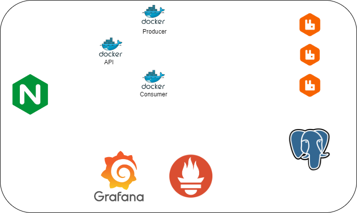

# Event driver 

## Docker

1. **Docker Compose de Rabbitmq com Alta Disponibilidade**

    - Configuração de Múltiplas Réplicas: Configure um cluster Rabbitmq com pelo menos três brokers para garantir a alta disponibilidade. Utilize o docker-compose.yml para definir os serviços e as redes necessárias.

    - Configure a replicação e a persistência de dados.

    - Persistência de Dados: Utilize volumes Docker para garantir que os dados do Rabbitmq e do Zookeeper sejam persistentes, mesmo após a reinicialização dos containers.

2. **Producer e consumer em Python**

    - Estrutura do Código: Separe o código em dois módulos: um para o producer e outro para o consumer. Utilize bibliotecas como Rabbitmq-python ou confluent-Rabbitmq para interagir com o Rabbitmq.

    - Gerenciamento de Erros e Retries: Implemente lógica de tratamento de erros e retries no producer para garantir que as mensagens sejam processadas corretamente.

    - Testes Unitários: Crie testes unitários para o código do producer e do consumer, garantindo que eles funcionem conforme o esperado.

3. **Monitoramento com Prometheus e Grafana**

    - Exportador do Rabbitmq: Utilize o Rabbitmq Exporter para coletar métricas do Rabbitmq e enviá-las para o Prometheus.

    - Configuração do Prometheus: Crie um arquivo de configuração do Prometheus que defina os targets para o Rabbitmq e outros serviços.

    - Dashboards do Grafana: Crie dashboards no Grafana para visualizar métricas como latência, throughput e taxa de erro do Rabbitmq. Utilize gráficos e alertas para monitorar a saúde do sistema.

## Diagrama da Arquitetura

